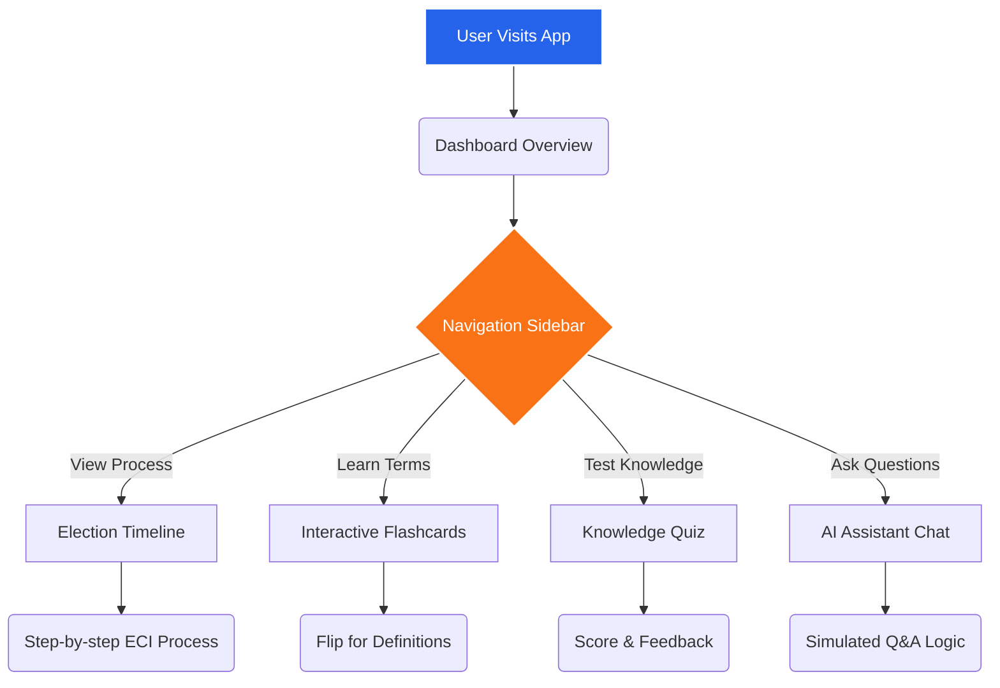

# Indian Election Education Assistant 🗳️🇮🇳

Welcome to the **Indian Election Education Assistant**! This is an interactive web application designed to educate citizens about the world's largest democratic exercise—the Indian Election System. 

The application provides a guided, visually engaging experience to learn about election timelines, key terminology, and voting procedures, and even includes a simulated AI assistant to answer your questions.

---

## 🌟 Key Features

1. **Interactive Dashboard**: A high-level overview of the Indian democratic structure (Lok Sabha, Rajya Sabha, State Assemblies) and key statistics.
2. **Election Timeline**: A step-by-step visual walkthrough of how elections are conducted by the Election Commission of India (ECI), from delimitation to the declaration of results.
3. **Electoral Flashcards**: Interactive 3D flip cards to quickly learn essential terminology like **EVM**, **VVPAT**, **NOTA**, and the **Model Code of Conduct (MCC)**.
4. **Knowledge Quiz**: Test your understanding of the election process with a dynamic multiple-choice quiz system that provides immediate feedback and explanations.
5. **AI Election Assistant**: A built-in simulated chat interface where users can ask questions (or use suggestion chips) about registration, voting steps, and electoral rules.

---

## 🏗️ Architecture & Flow Diagram

The application is built using lightweight, vanilla web technologies to ensure speed and simplicity. Below is a diagram illustrating the user flow and application structure:



---

## 🛠️ Technology Stack

- **Frontend**: HTML5, Vanilla JavaScript (ES6+), CSS3
- **Styling**: Modern CSS with Flexbox/Grid, CSS Variables, and micro-animations. FontAwesome for icons.
- **Containerization**: Docker (Nginx Alpine image for serving static files).

---

## 🚀 How to Run Locally

You can run this application locally without installing any complex dependencies. 

1. **Clone the repository:**
   ```bash
   git clone https://github.com/Archanachaurasiya30/ELection-process.git
   cd ELection-process
   ```
2. **Start a local HTTP Server:**
   If you have Python installed, run:
   ```bash
   python -m http.server 8000
   ```
3. **Open your browser:**
   Navigate to `http://localhost:8000`

---

## ☁️ Deployment (Google Cloud Run)

This repository includes a `Dockerfile` to easily deploy the static application to Google Cloud Run using an Nginx server. 

If you do not have the Google Cloud CLI installed locally, you can deploy it directly via **Google Cloud Shell**:

1. Open [Google Cloud Console](https://console.cloud.google.com/).
2. Activate **Cloud Shell** (the `>_` icon in the top right).
3. Clone the repo and deploy:
   ```bash
   git clone https://github.com/Archanachaurasiya30/ELection-process.git
   cd ELection-process
   gcloud run deploy election-eduassist --source . --allow-unauthenticated
   ```

---

**Made with ❤️ to promote electoral literacy and democratic participation.**
